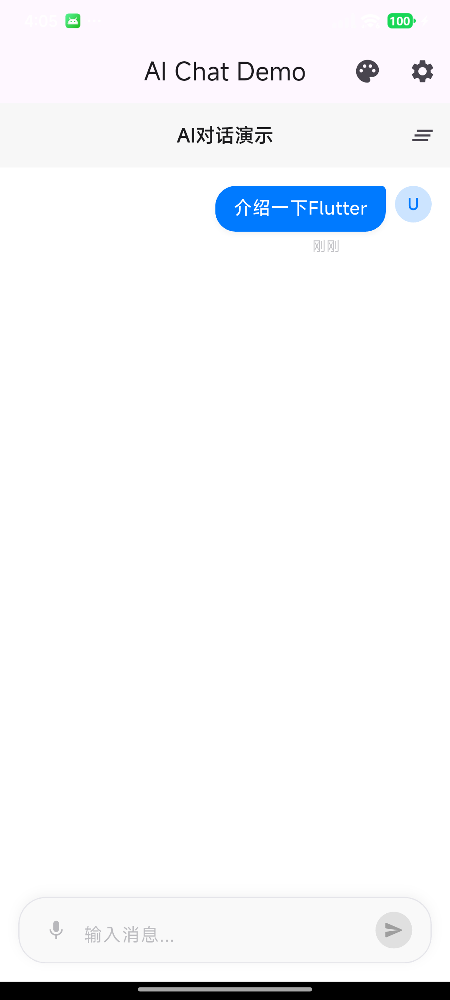
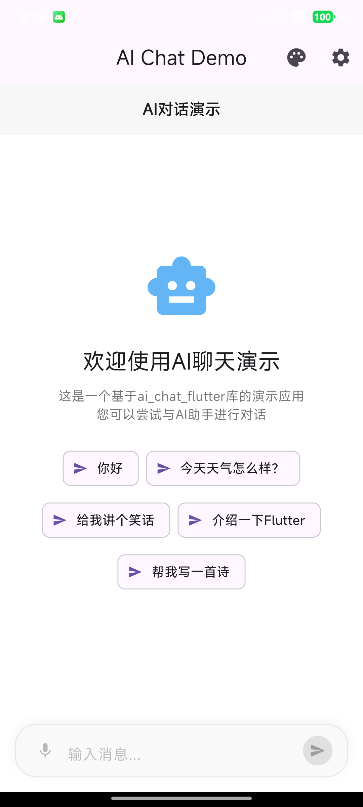
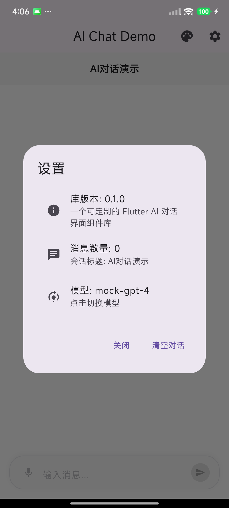

# 🧠 ai_chat_flutter

一个 **可定制的 Flutter AI 对话界面组件库**，用于快速构建类似 ChatGPT、Claude、Gemini 等智能对话界面。
支持 **流式回复、气泡样式自定义、消息状态管理** 等特性，轻松打造现代化 AI 聊天体验。

---

## ✨ 功能特性

* 💬 **流式回复**：支持实时输出，模拟打字机效果。
* 🎨 **气泡样式自定义**：轻松自定义用户与助手消息外观。
* 🔄 **消息状态管理**：内置发送中、已发送、失败等状态。
* 📜 **历史记录展示**：支持加载历史对话记录。
* 🧩 **高度可扩展**：可自由接入任意 AI Provider（OpenAI、Claude、自建接口等）。
* 🌗 **暗黑模式支持**：自动适配系统主题。

---

## 📸 示例截图





> 将截图文件放入仓库根目录下的 `screenshots/` 文件夹即可由 README 自动引用。

---

## 🚀 快速开始

### 1️⃣ 添加依赖

在项目 `pubspec.yaml` 中添加：

```yaml
dependencies:
  ai_chat_flutter: ^0.0.1
```

然后执行：

```bash
flutter pub get
```

---

### 2️⃣ 导入包

```dart
import 'package:ai_chat_flutter/ai_chat_flutter.dart';
```

---

### 3️⃣ 基础使用示例

```dart
import 'package:flutter/material.dart';
import 'package:ai_chat_flutter/ai_chat_flutter.dart';

void main() {
  runApp(const MyApp());
}

class MyApp extends StatelessWidget {
  const MyApp({super.key});

  @override
  Widget build(BuildContext context) {
    return MaterialApp(
      title: 'AI Chat Demo',
      theme: ThemeData(useMaterial3: true),
      home: const ChatExamplePage(),
    );
  }
}

class ChatExamplePage extends StatefulWidget {
  const ChatExamplePage({super.key});

  @override
  State<ChatExamplePage> createState() => _ChatExamplePageState();
}

class _ChatExamplePageState extends State<ChatExamplePage> {
  late final ChatController _controller;

  @override
  void initState() {
    super.initState();
    _controller = ChatController(
      provider: MockAiProvider(), // 示例 Provider，可自定义实现
    );
  }

  @override
  Widget build(BuildContext context) {
    return Scaffold(
      appBar: AppBar(title: const Text('AI Chat')),
      body: ChatView(controller: _controller),
    );
  }
}
```

---

## 💡 主要组件介绍

| 组件 | 说明 |
| --- | --- |
| `ChatView` | 对话整体组件，包含消息列表与输入框 |
| `ChatController` | 管理消息流与状态，支持流式回调 |
| `ChatMessage` | 消息数据模型（角色、内容、状态） |
| `MessageBubble` | 消息气泡渲染，支持自定义样式 |
| `MessageInput` | 输入栏组件，支持发送、加载、重试 |

---

## 🎨 自定义气泡样式

支持通过 `ChatTheme` 自定义用户与助手消息样式：

```dart
ChatView(
  controller: controller,
  theme: ChatTheme(
    userBubbleColor: Colors.blue.shade200,
    assistantBubbleColor: Colors.grey.shade200,
    userTextStyle: const TextStyle(color: Colors.white),
    assistantTextStyle: const TextStyle(color: Colors.black87),
  ),
)
```

---

## 🔄 消息状态

框架内置多种状态，用于区分消息生命周期：

| 状态 | 枚举值 | 说明 |
| --- | --- | --- |
| 发送中 | `MessageStatus.sending` | 用户刚发送，等待响应 |
| 流式中 | `MessageStatus.streaming` | AI 正在逐字输出 |
| 已完成 | `MessageStatus.sent` | AI 回复完成 |
| 失败 | `MessageStatus.error` | 请求失败或超时 |

状态可通过 `ChatController` 更新，例如：

```dart
controller.addUserMessage('你好');
await controller.sendAndStream();
```

---

## 🧩 自定义 Provider 接口

可以实现 `AiProvider` 抽象类，接入任何模型接口：

```dart
class MyAiProvider implements AiProvider {
  @override
  Future<void> stream({
    required List<ChatMessage> messages,
    required Function(String) onToken,
    required Function() onDone,
    required Function(Object) onError,
    Map<String, dynamic>? options,
  }) async {
    // 调用自定义 AI 接口
  }

  @override
  Future<String> complete({
    required List<ChatMessage> messages,
  }) async {
    return '这是完整回复示例';
  }
}
```

---

## 📦 文件结构建议

```
ai_chat_flutter/
  lib/
    ai_chat_flutter.dart
    src/
      controllers/
      widgets/
      models/
  example/
    lib/
      main.dart
  screenshots/
```

---

## 🧪 示例运行

```bash
cd example
flutter run
```

---

## 🪄 开发计划

* [ ] 支持 Markdown + 代码块渲染
* [ ] 图片消息支持
* [ ] 多模型切换与上下文记忆

---

## ❤️ 开源许可

本项目基于 **MIT License** 开源。
欢迎提交 PR 或 issue，一起完善 Flutter AI 对话生态！

---

如果你在发版前需要帮助，例如完善 `CHANGELOG.md` 或配置 `LICENSE`，可以继续告诉我。
